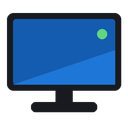

# ioBroker.pro-bravia

[](https://www.npmjs.com/package/iobroker.pro-bravia)
[](https://www.npmjs.com/package/iobroker.pro-bravia)
[](https://github.com/AlanSRU/ioBroker.pro-bravia/blob/main/LICENSE)

Control and monitor **Sony BRAVIA Professional Displays** (the FW-xxBZ commercial signage range) from
ioBroker.

This adapter targets the *professional* displays rather than domestic Android TVs. It speaks all four
of Sony's control interfaces and, crucially, **discovers what your particular display supports at
runtime** instead of shipping a fixed per-model table — the professional range varies by model,
firmware and EU RED-DA compliance variant.

## Control interfaces

| Interface | Used for | Notes |
|---|---|---|
| **REST API** | The full command surface — power, inputs, picture, audio, apps, system settings | JSON-RPC over HTTP, authenticated with a pre-shared key |
| **Simple IP Control** | Instant push updates, plus picture mute | The only interface that pushes; without it, changes made at the display appear only at the next poll |
| **IRCC-IP** | Remote-control key emulation for menu and OSD navigation | Key table is read from the display itself |
| **Wake-on-LAN** | Recovering a suspended display | A suspended panel shuts down its HTTP server, so this is the only route back |

Simple IP Control and IRCC-IP can each be switched off in the instance settings if you would rather
run REST-only.

## Setup

On the display:

1. **Settings → Network & Internet → Remote device settings → Control remotely** — enable.
2. **Settings → Network & Internet → Home network → IP control → Authentication** — choose
   *Pre-Shared Key* and set a key.
3. **Settings → Network & Internet → Home network → IP control → Simple IP control** — enable
   (only needed if you want push updates).
4. Enable **Wake-on-LAN** under Remote device settings if you want to wake a suspended display.

In ioBroker, create an instance, enter the display's IP address and the pre-shared key, and press
**Test connection**.

## What gets created

Most of the state tree is **discovered**, so it matches your display rather than a generic template.

| Channel | Contents |
|---|---|
| `info` | Model, serial, MAC, IP, API generation, connection indicators, last error |
| `power` | `state`, `status`, `toggle`, `reboot`, `wake` |
| `system` | Power saving mode, Wake-on-LAN mode, LED indicator mode/status, display clock |
| `audio` | `volume`, `mute`, `volumeUp`/`volumeDown`, per-output channels, discovered speaker and sound settings |
| `video` | Discovered picture-quality targets, `pictureMute`, `screenRotation` |
| `input` | `select`, `current`, `currentTitle`, `list`, and one channel per physical input with its user label and connection status |
| `scene` | Scene setting (models that support it) |
| `apps` | Installed application list, launch by URI, per-app launch buttons, terminate |
| `remote` | One button per discovered remote key, plus raw IRCC code send |

### Discovery in practice

`getPictureQualitySettings` reports each target with its candidate values, and those map straight
onto ioBroker object metadata:

| The display reports | You get |
|---|---|
| `{ "min": 0, "max": 100, "step": 1 }` | a number state with `min`/`max`/`step` set |
| `[{"value":"vivid"},{"value":"standard"}]` | a string state with `common.states` populated |
| `[{"value":"on"},{"value":"off"}]` | a boolean switch |
| no candidates | a free-text state |

A target the display reports as `isAvailable: false` (not applicable to the current input) still gets
a state, so it does not disappear and reappear as you switch inputs.

## Known limitations

- **`setScreenRotation`** is documented by Sony as callable from localhost only, and only on recent
  FW-BZxxx firmware. The state is created when the display advertises the method, but writes may be
  refused over the network.
- **Scene setting** is not implemented by the BZ40P / BZ35P / BZ30P models; the state is not created
  on those displays.
- **`getSoundSettings`** is not documented for professional displays. If the display does not answer
  it, the adapter falls back to the documented `outputTerminal` target.
- **Powering on** over REST only works from *Sleep*. From full suspend the HTTP server is down, and
  the adapter automatically falls back to Wake-on-LAN.
- **EU models** ship in three RED-DA compliance variants with different available commands. Capability
  discovery handles this, but some states will be absent on restricted variants.

## Development

```bash
npm install
npm test          # unit and integration tests against a mock display
npm run check     # type check
npm run lint
npm run build
```

Tests run against `test/mock-bravia-server.ts`, a mock display that serves both the HTTP JSON-RPC
face and the Simple IP Control TCP face from one shared state object — so a REST write raises the
matching SSIP notification, exactly as real hardware does. No display is needed to develop or test.

Protocol notes gathered from Sony's documentation live in [docs/PROTOCOL.md](docs/PROTOCOL.md).

## Changelog

<!-- **WORK IN PROGRESS** -->

### 0.0.1

- Initial release

## License

MIT License — see [LICENSE](LICENSE).

Copyright (c) 2026 Alan Paris <alan.paris@scottish.rugby>
